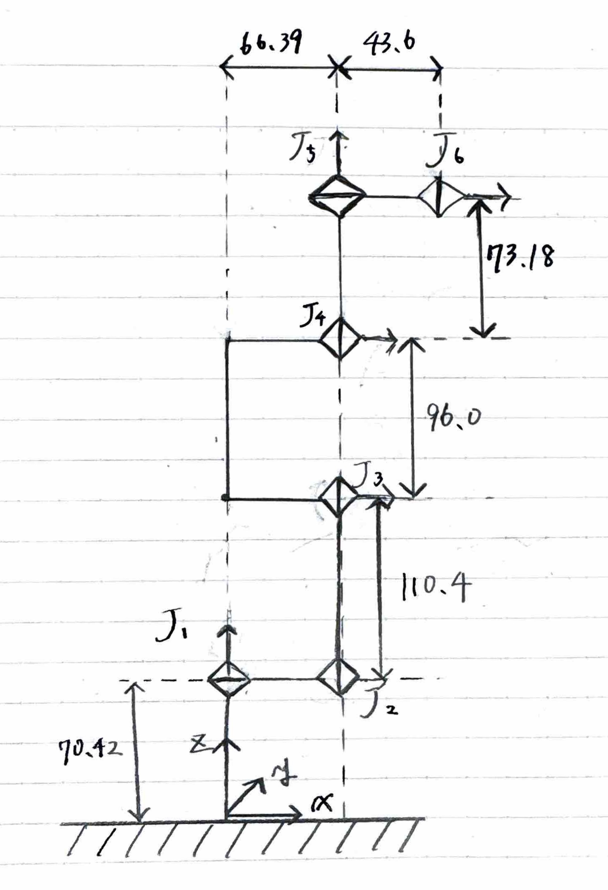
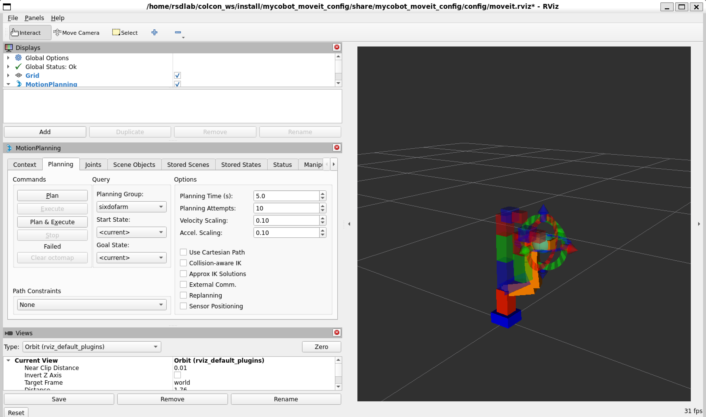

# mycobot_moveit_config

## 概要
このパッケージはMyCobot 280をMoveIt2で動作させるためのROS2パッケージである．


## 環境

- Ubuntu22.04(WSL2)
- ROS 2 Humble
- MoveIt 2
- Python 3

## MyCobot280のリンク図
今回対象となるMyCobot280のリンク図を下図に示す．



## 動作手順

1. GitHubからリポジトリをクローン
   ```bash
   cd ~/colcon_ws/src
   git clone https://github.com/rsdlab-26008/mycobot_moveit_config.git
   ```

2. ワークスペースでビルド
   ```bash
   cd ~/colcon_ws
   colcon build --symlink-install
   source install/setup.bash
   ```

3. 起動
   ```bash
   ros2 launch mycobot_moveit_config demo.launch.py
   ```

4. Rviz上でアーム操作

   RViz2のMotionPlanningパネルでインタラクティブマーカーを動かし，アームを任意の姿勢に動かす．
   
   位置が決まったら，パネルでPlan → Executeを選択することで腕の操作が可能となる！


